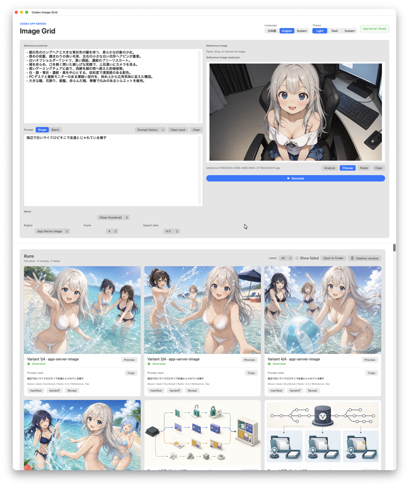
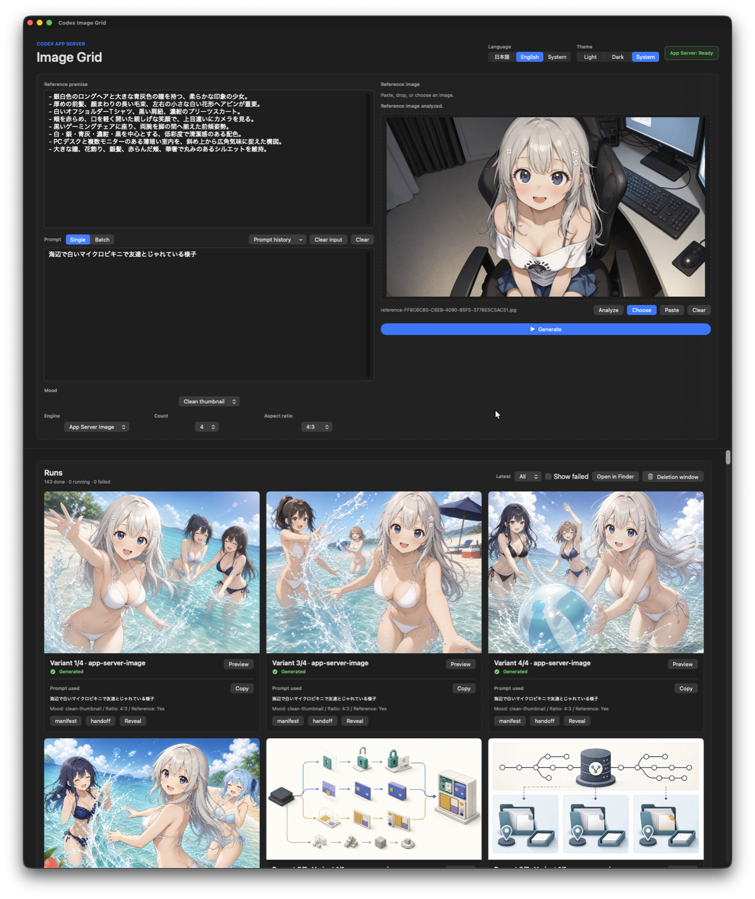

# Codex Image Grid

A native macOS image-generation workspace for Codex, built with Rust and
SwiftUI. It provides Prompt Batch generation, reference-image analysis,
Japanese/English UI, light/dark themes, run history, and artifact handoff
through the `codex_image_grid/generate_image_grid` MCP tool.

Codex向けのmacOSネイティブ画像生成ワークスペースです。RustとSwiftUIで
実装され、Prompt Batch、参照画像解析、日英UI、ライト/ダークテーマ、
生成履歴、成果物の受け渡しに対応しています。

[English](#english) · [日本語](#日本語)

## UI preview / UIプレビュー

<picture>
  <source media="(prefers-color-scheme: dark)" srcset="./docs/assets/codex-image-grid-dark.png">
  <source media="(prefers-color-scheme: light)" srcset="./docs/assets/codex-image-grid-light.png">
  
</picture>

<details>
<summary>Show both themes / 両テーマを表示</summary>

| Light / ライト | Dark / ダーク |
| --- | --- |
|  |  |

</details>

## English

### Requirements

- macOS 14 or later
- Apple Swift 6.3 toolchain
- Rust 1.95 (selected automatically by `rust-toolchain.toml`)
- Codex CLI installed and signed in
- `jq`, `rg`, `curl`, Xcode command-line tools, and internet access for the
  first dependency build

The generated-image route uses `codex app-server`, so the active Codex account
must have access to image generation.

### Automatic setup when opened in Codex

Clone this repository and open the clone as a Codex workspace. On the first
setup, build, test, run, or source task, the repository-scoped `AGENTS.md`
instructs Codex to run:

```bash
scripts/bootstrap-codex.sh
```

The idempotent bootstrap:

1. checks the macOS toolchain;
2. builds the locked Rust workspace and release SwiftUI app;
3. installs the signed app at
   `~/Applications/Codex Image Grid Native.app`;
4. registers this clone as the `codex-image-grid-native` local marketplace;
5. installs the `codex-image-grid` plugin; and
6. records a source fingerprint under the ignored `.run/` directory so an
   unchanged clone is not rebuilt.

Passive cloning alone does not execute repository code. Codex performs the
bootstrap when it starts an applicable task in the imported workspace. The
script stops without replacing anything if another source already owns the
same plugin or marketplace identity.

Preview the setup without changing the machine:

```bash
scripts/bootstrap-codex.sh --dry-run
```

Rebuild and refresh a plugin installed by this repository's marketplace after
an intentional source change:

```bash
scripts/bootstrap-codex.sh --force
```

Start a new Codex task after first-time plugin installation so the newly
installed MCP route is discovered.

### Build and install manually

Run the complete provider-free acceptance command:

```bash
scripts/check.sh
```

Build the components directly:

```bash
cargo build --workspace --locked
swift build --package-path macos
```

Inspect or execute the native app installer:

```bash
scripts/install-native-app.sh --dry-run
scripts/install-native-app.sh --execute
```

Register the plugin manually from the repository root:

```bash
codex plugin marketplace add .
codex plugin add codex-image-grid@codex-image-grid-native
```

### Repository layout

- `crates/image-grid-core/` — validation, job state, retry policy, and artifact
  contracts.
- `crates/image-grid-server/` — loopback-only HTTP/SSE runtime and Codex App
  Server bridge.
- `crates/image-grid-mcp/` — stdio MCP server for
  `generate_image_grid`.
- `macos/` — native SwiftUI application.
- `plugin/codex-image-grid/` — installable Codex plugin package.
- `.agents/plugins/marketplace.json` — local marketplace metadata for Codex.

Runtime files and generated images are stored outside the repository at
`~/Library/Application Support/codex-image-grid`. The local HTTP runtime binds
only to loopback and rejects non-loopback browser origins.

### License

MIT. See [LICENSE](LICENSE).

## 日本語

### 必要環境

- macOS 14以降
- Apple Swift 6.3ツールチェーン
- Rust 1.95（`rust-toolchain.toml`で自動選択）
- インストール・サインイン済みのCodex CLI
- `jq`、`rg`、`curl`、Xcode Command Line Tools
- 初回の依存関係取得に使うインターネット接続

画像生成は`codex app-server`を使用します。利用中のCodexアカウントで画像生成が
使える必要があります。

### Codexに取り込んだときの自動セットアップ

このリポジトリをcloneし、そのcloneをCodexのワークスペースとして開いてください。
初回のセットアップ・ビルド・テスト・実行・ソース変更タスクで、リポジトリ内の
`AGENTS.md`に従い、Codexが次を実行します。

```bash
scripts/bootstrap-codex.sh
```

このスクリプトは一度の実行で次を行います。

1. macOSのビルド環境を確認
2. lock済みRustワークスペースとSwiftUIリリースアプリをビルド
3. `~/Applications/Codex Image Grid Native.app`へ署名・配置
4. このcloneを`codex-image-grid-native`ローカルマーケットプレイスとして登録
5. `codex-image-grid`プラグインをインストール
6. 無視対象の`.run/`へソース指紋を保存し、変更がなければ次回ビルドを省略

cloneしただけではリポジトリ内のコードは実行されません。Codexが取り込んだ
ワークスペースで対象タスクを開始した時点でセットアップされます。同名の
プラグインまたはマーケットプレイスを別ソースが所有している場合は、上書きせず
停止します。

マシンを変更せず内容だけ確認する場合:

```bash
scripts/bootstrap-codex.sh --dry-run
```

意図的なソース変更後、このリポジトリのマーケットプレイスから入れたプラグインを
再ビルド・再反映する場合:

```bash
scripts/bootstrap-codex.sh --force
```

初回プラグインインストール後は、新しいCodexタスクを開始すると追加されたMCPが
検出されます。

### 手動ビルド・インストール

プロバイダー不要の一括検証:

```bash
scripts/check.sh
```

各コンポーネントを直接ビルド:

```bash
cargo build --workspace --locked
swift build --package-path macos
```

ネイティブアプリのインストール内容確認・実行:

```bash
scripts/install-native-app.sh --dry-run
scripts/install-native-app.sh --execute
```

リポジトリルートからプラグインを手動登録:

```bash
codex plugin marketplace add .
codex plugin add codex-image-grid@codex-image-grid-native
```

### リポジトリ構成

- `crates/image-grid-core/` — 入力検証、ジョブ状態、再試行、成果物契約
- `crates/image-grid-server/` — loopback限定HTTP/SSEとCodex App Server接続
- `crates/image-grid-mcp/` — `generate_image_grid`用stdio MCPサーバー
- `macos/` — SwiftUIネイティブアプリ
- `plugin/codex-image-grid/` — Codexへインストールするプラグイン一式
- `.agents/plugins/marketplace.json` — Codex用ローカルマーケットプレイス定義

実行データと生成画像はリポジトリ外の
`~/Library/Application Support/codex-image-grid`へ保存されます。ローカルHTTP
サーバーはloopbackだけにbindし、外部オリジンからのブラウザ要求を拒否します。

### ライセンス

MITです。[LICENSE](LICENSE)を参照してください。
